// SPDX-FileCopyrightText: 2017-2024 EfficiOS Inc.
// SPDX-License-Identifier: CC-BY-SA-4.0

// Render with Asciidoctor

// Show ToC at a specific location for a GitHub rendering
ifdef::env-github[]
:toc: macro
endif::env-github[]

ifndef::env-github[]
:toc: left
endif::env-github[]

// This is to mimic what GitHub does so that anchors work in an offline
// rendering too.
:idprefix:
:idseparator: -

= Babeltrace{nbsp}2: implementation details
Jérémie Galarneau
23 October 2024
:toclevels: 3
:icons: font
:nofooter:
:bt2: Babeltrace{nbsp}2

This document explains some implementation details of the {bt2}
project.

ifdef::env-github[]
// ToC location for a GitHub rendering
toc::[]
endif::env-github[]

== libbabeltrace2

Implementation details of the main {bt2} library.

=== Object reference counting and lifetime

This section covers the rationale behind the design of {bt2}'s
object lifetime management. This applies to the {bt2} library, as
well as to the CTF writer library (although the public reference
counting functions are not named the same way).

Starting from Babeltrace{nbsp}2.0, all publicly exposed objects
"`inherit`" (by composition) a common base: `bt_object`. This base
provides a number of facilities to all objects, chief amongst which are
lifetime management functions.

The lifetime of some public objects is managed by reference counting. In
this case, the API offers the `pass:[bt_*_get_ref()]` and
`pass:[bt_*_put_ref()]` functions which respectively increment and
decrement the reference count of an object.

As far as lifetime management in concerned, {bt2} makes a clear
distinction between regular objects, which have a single parent, and
root objects, which don't.

==== The problem

Let us consider a problematic case to illustrate the need for this
distinction.

With the {bt2} library, you create a trace class, which _has_ a stream
class (the class of a stream) and that stream class, in turn, _has_ an
event class (the class of an event).

Nothing prevents you from releasing his reference on any one of these
objects in any order. However, you can retrieve all objects in the
__trace--stream class--event class__ hierarchy from any other.

For instance, you could discard your reference on both the event class
and the stream class, only keeping a reference on the trace class. From
this trace class reference, you can enumerate stream classes, providing
you with a new reference to the stream class you discarded earlier. You
can also enumerate event classes from stream classes, providing you with
references to the individual event classes.

Conversely, you could also hold a reference to an event class and
retrieve its parent stream class. You can retrieve the trace class, in
turn, from the stream class.

This example illustrates what could be interpreted as a circular
reference dependency existing between these objects. Of course, if the
objects in such a scenario were to hold references to each other (in
both directions), we would be in presence of a circular ownership
resulting in a leak of both objects as their reference counts would
never reach zero.

Nonetheless, the API must offer the guarantee that holding a node to any
node of the graph keeps all other reachable nodes alive.

==== The solution

The scheme employed in {bt2} to break this cycle consists in the
"`children`" holding _reverse component references_ to their parents.
That is, in the context of the trace IR, that event classes hold a
reference to their parent stream class and stream classes hold a
reference to their parent trace class.

On the other hand, parents hold _claiming aggregation references_ to
their children. A claiming aggregation reference means that the object
being referenced must not be deleted as long as the reference still
exists. In this respect, it can be said that parents truly hold the
ownership of their children, since they control their lifetime.
Conversely, the reference counting mechanism is leveraged by children to
notify parents that no other child indirectly exposes the parent.

When the reference count of a parented object reaches zero, it invokes
`pass:[bt_*_put_ref()]` on its parent and does _not_ free itself.
However, from that point, the object depends on its parent to signal the
moment when it can be safely reclaimed.

The invocation of `pass:[bt_*_put_ref()]` by the last children holding a
reference to its parent might trigger a cascade of
`pass:[bt_*_put_ref()]` from child to parent. Eventually, a **root**
object is reached. At that point, if the reference count of this
orphaned object reaches zero, the object invokes the destructor method
defined by everyone of its children as part of their base `bt_object`.
The key point here is that the cascade of destructors will necessarily
originate from the root and propagate in preorder to the children. These
children will propagate the destruction to their own children before
reclaiming their own memory. This ensures that the pointer-to-parent
of a node is _always_ valid since the parent has the responsibility to
tear down its children before cleaning itself up.

Assuming a reference to an object is _acquired_ by calling
`pass:[bt_*_get_ref()]` while its reference count is zero, the object
acquires, in turn, a reference on its parent using
`pass:[bt_*_get_ref()]`. At that point, the child can be thought of as
having converted its weak reference to its parent into a regular
reference. That is why this reference is referred to as a _claiming_
aggregation reference.

==== Caveats

This scheme imposes a number of strict rules defining the relation
between objects:

* Objects may only have one parent.

* Objects, beside the root, are only retrievable from their direct
  parent or children.

==== Example

. The initial situation is rather simple: **User{nbsp}A** is holding a
  reference to a trace class, **TC1**. As per the rules previously
  enounced, stream classes **SC1** and **SC2** don't hold a reference to
  **TC1** since their own reference counts are zero. The same holds true
  for **EC1**, **EC2** and **EC3** with respect to **SC1** and **SC2**.
+
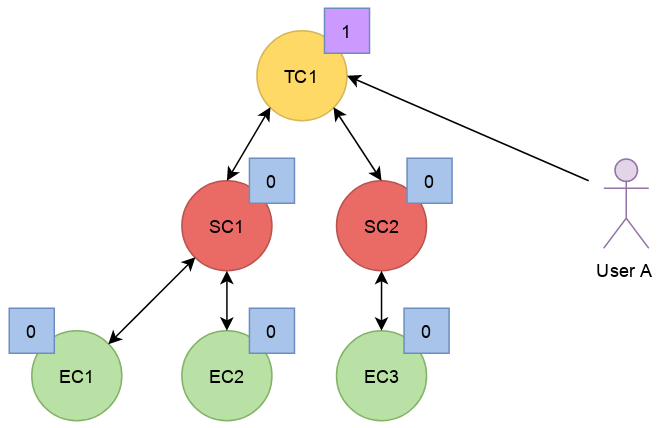

. In this second step, we can see that **User{nbsp}A** has acquired a
  reference on **SC2** through the trace class, **TC1**.
+
The reference count of the stream class transitions from zero to one,
triggering the acquisition of a strong reference on **TC1** from
**SC2**.
+
Hence, at this point, **User{nbsp}A** and **SC2** share the ownership
of the trace class.
+

. Next, **User{nbsp}A** acquires a reference on the **EC3** event class
  through its parent stream class, **SC2**. Again, the transition of the
  reference count of an object from zero to one triggers the acquisition
  of a reference on its parent.
+
Note that the reference count of **SC2** was incremented to two. The
reference count of the trace class remains unchanged.
+
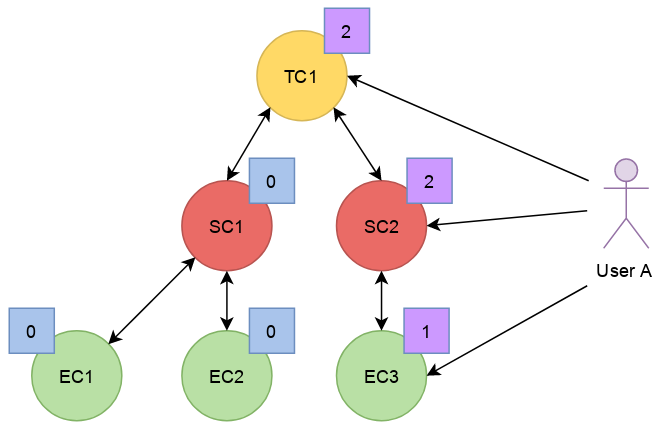

. **User{nbsp}A** decides to drop its reference on **SC2**. The
  reference count of **SC2** returns back to one, everything else
  remaining unchanged.
+
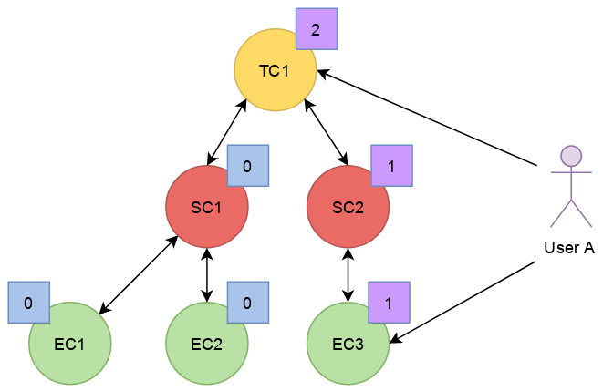

. **User{nbsp}A** can then decide to drop its reference on the trace
  class. This results in a reversal of the initial situation:
  **User{nbsp}A** now owns an event, **EC3**, which is keeping
  everything else alive and reachable.
+
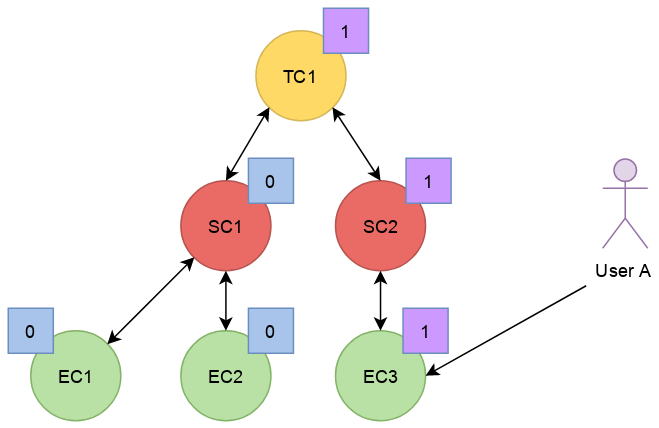

. If another object, **User{nbsp}B**, enters the picture and acquires a
  reference on the **SC1** stream class, we see that the reference count
  of **SC1** transitioned from zero to one, triggering the acquisition
  of a reference on **TC1**.
+
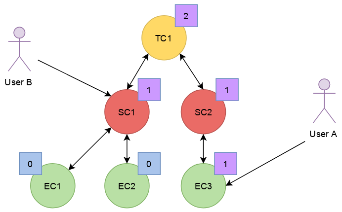

. **User{nbsp}B** hands off a reference to **EC1**, acquired through
  **SC1**, to another object, **User{nbsp}C**. The acquisition of a
  reference on **EC1**, which transitions from zero to one, triggers the
  acquisition of a reference on its parent, **SC1**.
+
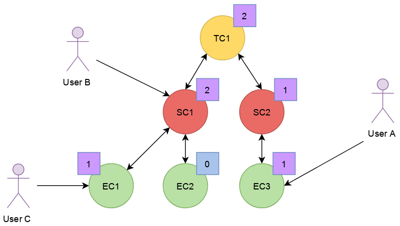

. At some point, **User{nbsp}A** releases its reference on **EC3**.
  Since the reference count of **EC3** transitions to zero, it releases
  its reference on **SC2**. The reference count of **SC2**, in turn,
  reaches zero and it releases its reference to **TC1**.
+
The reference count of **TC1** is now one and no further action is
taken.
+
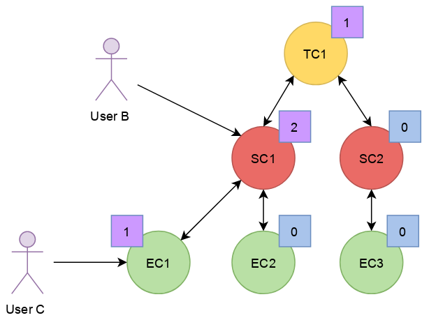

. **User{nbsp}B** releases its reference on **SC1**. **User{nbsp}C**
  becomes the sole owner of the whole hierarchy through his ownership of
  **EC1**.
+
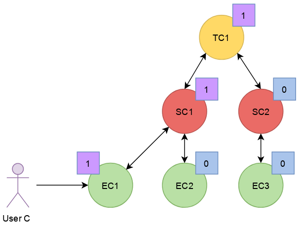

. Finally, **User{nbsp}C** releases his ownership of **EC1**, triggering
  the release of the whole hierarchy. Let's walk through the reclamation
  of the whole graph.
+
Mirroring what happened when **User{nbsp}A** released its last reference
on **EC3**, the release of **EC1** by **User{nbsp}C** causes its
reference count to fall to zero.
+
This transition to zero causes **EC1** to release its reference on
**SC1**. The reference count of **SC1** reaching zero causes it to
release its reference on **TC1**.
+
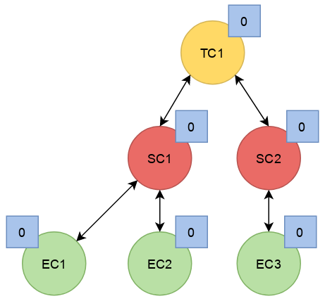

. Since the reference count of **TC1**, a root object, has reached zero,
  it invokes the destructor method on its children. This method is
  recursive and causes the stream classes to call the destructor method
  on their event classes.
+
The event classes are reached and, having no children of their own, are
reclaimed.
+
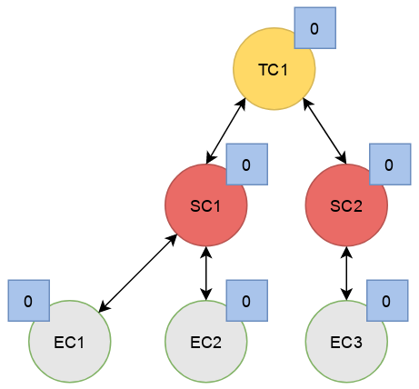

. The stream classes having destroyed their children, are then reclaimed
  by the trace class.
+
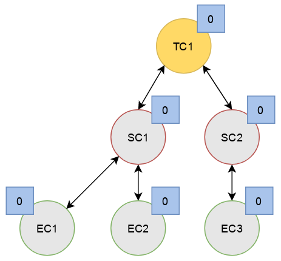

. Finally, the stream classes having been reclaimed, **TC1** is reclaimed.
+
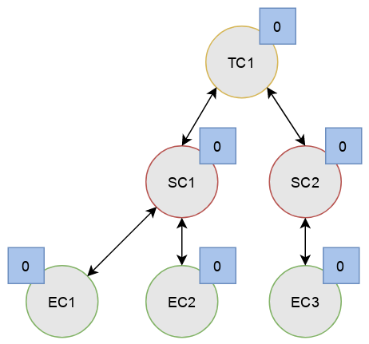
